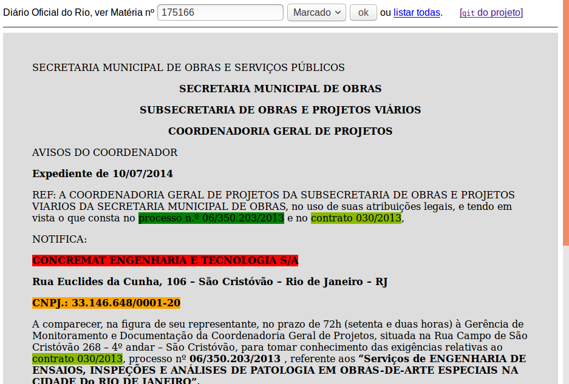

**"Projeto Nosso Querido Diario Oficial"**, abreviadamente **`queriDO`**.  

O projeto estabelece uma metodologia para recuperação da informação registrada nos diários oficiais (*DO*s), a partir dos interesses e metas de um coletivo, que se responsabiliza pela tutela dessas informações e por manifestar publicamente o seu parecer em relatórios fundamentados nos *DO*s.

A **comunidade mantenedora deste projeto** é formada por dois grupos:

* **curadorias**: definem os "alvos", estabelcem para quais assuntos e diários oficiais desejam voltar seus olhares, fazer suas explorações, e mais tarde entregar seus relatórios e pareceres. PS: não há restrição à participação em mais de uma curadoria.

* **experts**: entusiastas de dados abertos e [*data scraping*](https://en.wikipedia.org/wiki/Data_scraping), ajudando  a *curadoria* a achar a "agulha no palheiro", e preparar milhares de *separatas* de diários oficiais para constituir um [*corpus* textual](https://en.wikipedia.org/wiki/Corpus_linguistics) de análise: bem estruturado e suficientemente completo para cada *alvo* definido pelas *curadoriais*.   PS: um _expert_ pode também ser membro de uma _curadoria_; existe um subconjunto dos *experts*  que [contribui também no desenvolvimento](https://github.com/okfn-brasil/queriDO/graphs/contributors) do software do projeto.

[Clique aqui](https://okfn-brasil.github.io/queriDO/) para testar as separatas elencadas pela [*Curadoria da ciclovia Tim Maia*](report/curadoria001.md).

Maiores detalhes ver um [breve histórico do projeto](_docs/README.md).

-----

## Dinâmica de um ciclo de registros

Dinâmica da formação de alvos e conteúdos neste projeto:

**Passo-1**. **Manifestação de interesse**. Um grupo de pessoas (curadores) entra em contato com o projeto e  [se registra nesta planilha](data/curadoria.csv) (editável [neste GDoc](https://docs.google.com/spreadsheets/d/1-LqoLFCMPWs0UHrY3WXSV10S9eYIxpshOzDXsIFXlJA/edit#gid=770195002)), estabelecendo informalmente uma denominação e um alvo.

**Passo-2**. **Formalização da _curadoria_ e seu _alvo_**. Acolhidos por pelo menos um [membro da OKBr](https://br.okfn.org/membros/), que auxilia o grupo expor mais detalhes sobre motivações e metas, [num Relatório de Apresentaço como este](report/curadoria001.md) (`report/curadoria001-apresent.md`). Havendo necessidade os dados da planilha são modificados para refletir melhor o expresso pelo relatório.

**Passo-3**.  **Testes, prospecção e avaliação da viabilidade**. Com apoio do grupo de *experts*, a nova curadoria faz testes de prospecção (usando outras ferramentas como o Diário Livre, os diversos diários oficiais, etc.) e define com mais precisão seu alvo, reformulando-os se necessário. Com os testes também refina o seu relatório e "bate martelo" sobre qual Diário Oficial e quais anos prospectar.

**Passo-4**.  **Resgate dos origiais**. A equipe de *experts* recupera os conteúdos oficiais (separatas de Diários Oficiais) de forma o mais fiel possível, armazenando no *git* do presente projeto todos os [conteúdos originais](content/original).

**Passo-5**.  **Filtragen**. A equipe de *experts* avalia a melhor forma de "limpar" os originais e armazená-los como [conteúdos filtrados](content/filtrado). Com este conteúdo disponibilizado em ferramentas de busca e visualização, torna-se possível decidir quais elementos precisam ser marcados. Nesta etapa a *curadoria*  também já pode se manifestar sobre a fidelidade e completeza do material obtido.

**Passo-6**.  **Marcação**. A equipe de *experts* avalia a melhor forma de "marcar" os conteúdos filtrados para destacar e organizar com precisão todas as informações a serem extraídas e relacionadas entre si.

**Passo-7**.  **Revisão do levantamento e da marcação**. A curadoria avalia o material marcado e seu uso, eventualmente solicitando mais conteúdos, por exemplo matérias citadas (adendos que citam contratos, leis que citam outras leis, etc.)

**Passo-8**.  **Relatório da curadoria**. Em posse de toda a informação a *curadoria* emite um parecer e um ou mais relatórios onde faz uso das informações para as finalidades desejadas.

Todos os conteúdos, originais e marcados, são preservados no git por tempo indeterminado (horizonte de *anos*). O ciclo pode se repetir para aprofundamentos ou ampliação das pesquisas.

## Avaliando conteúdos dos DOs

Testes básicos de visualização das matérias dos DOs podem ser realizados em https://okfn-brasil.github.io/queriDO/ (ilustração abaixo).

Os *passos 4, 5 e 6* descritos acima são indicados nas visualizações como "resultantes" 1, 2 e 3 respectivamente.

Os termos coloridos são justamente os elementos marcados: definem em contexto adequado a valores, citações, códigos ou nomes relevates para a análise e cruzamento de dados no diário oficial. Softwares adicionais podem compor planilhas de dados extraídos de dezenas ou milhares desses registros.

## Documentação do projeto
Ver .

------

## Licensas livres

Esta iniciativa é mantida pela [Plataforma de Projetos da OKBr](https://br.okfn.org/projetos/).

Todos os softwares e conteúdos deste projeto são livres, em conformidade com a [OpenDefinition](http://openDefinition.org/od/2.0/pt-br/):

* *conteúdos dos Diários Oficiais* são [implicitamente de domínio público (licensa **CC0**)](https://github.com/ppKrauss/licenses/blob/master/reports/implied-lex-BR-v1.md).

* os *softwares* produzidos pela OKBr e seus colaboradores do projeto queriDO receberam [licensa **MIT**](https://opensource.org/licenses/MIT).

* os *demais conteúdos* receberam licensa [**CC-BY-3.0**](https://creativecommons.org/licenses/by/3.0/br/)
