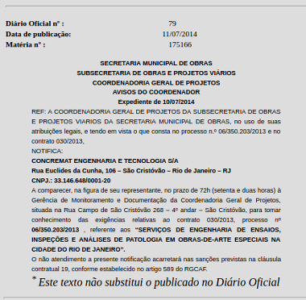
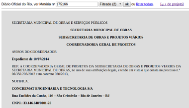
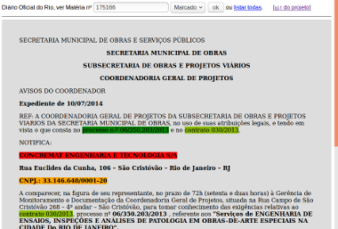
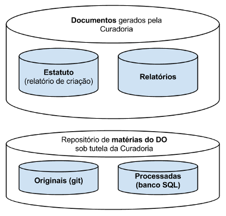
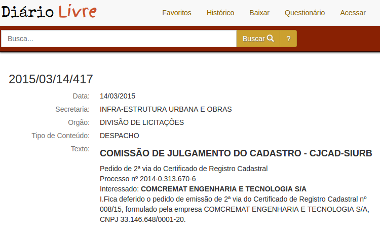

# Documentação

A metodologia do projeto QueriDO tem seu foco na gestão de *relatórios* das curadorias e num *banco de dados* das matérias trazidas do Diário Oficial.

Quem traz as matérias originais é o *módulo TrazDia*, e então elas são preservadas no *Github* na pasta `content/original`. Em seguida os processos são assistidos:  quem faz a filtragem e reestruturação são os *módulos CleanDoc e StrutDoc*, e quem faz a marcação final é o *módulo MarkDoc*. Se por acaso um desses passos requerer intervenção humana, o resultado da intervenção é registrado no *Github*, complementando o `content/original`. Todo o restante, automatizado, é mantido em no banco de dados. As ferramentas do *módulo de Pesquisa* no banco de dados também permitem extração automatica de dados, gerando planilhas e outros formatos de dados para análise ou registro na forma de relatório.

Por fim, os relatporios redigidos pela curadoria são armazenados na pasta `report`.

## Tratamento primário
Registro da matéria original, sua filtragem e marcação.

* Passo-1: obter e conferir o original. O *módulo TrazDia* faz isso automaticamente.  

* Passo-2: filtrar. Em geral será automático sem necessidade de intervenção). 

* Passo-3: marcar. As regras de marcação precisam ser revisadas pela curadoria, e eventualmente algumas marcações precisam ser feitas manualmente. 

## Repositório QueriDO

## Módulos do QueriDO

...

## Busca em outros diários
A organização dos materiais é feita a cada Diário Oficial, mas pode-se compor um relatório mais amplo vinculando duas curadorias de diários distintos.

